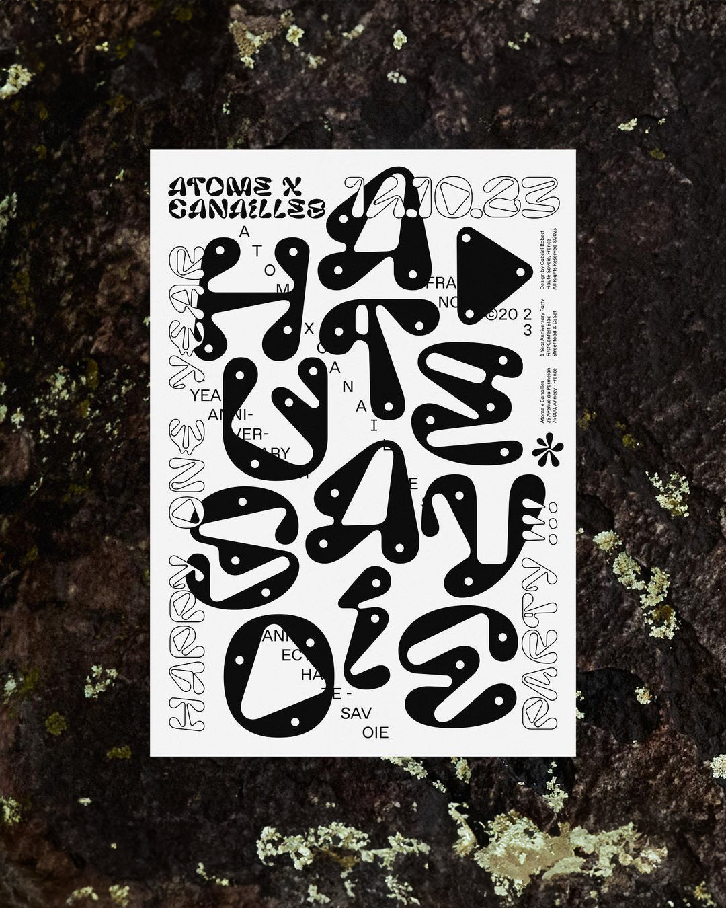
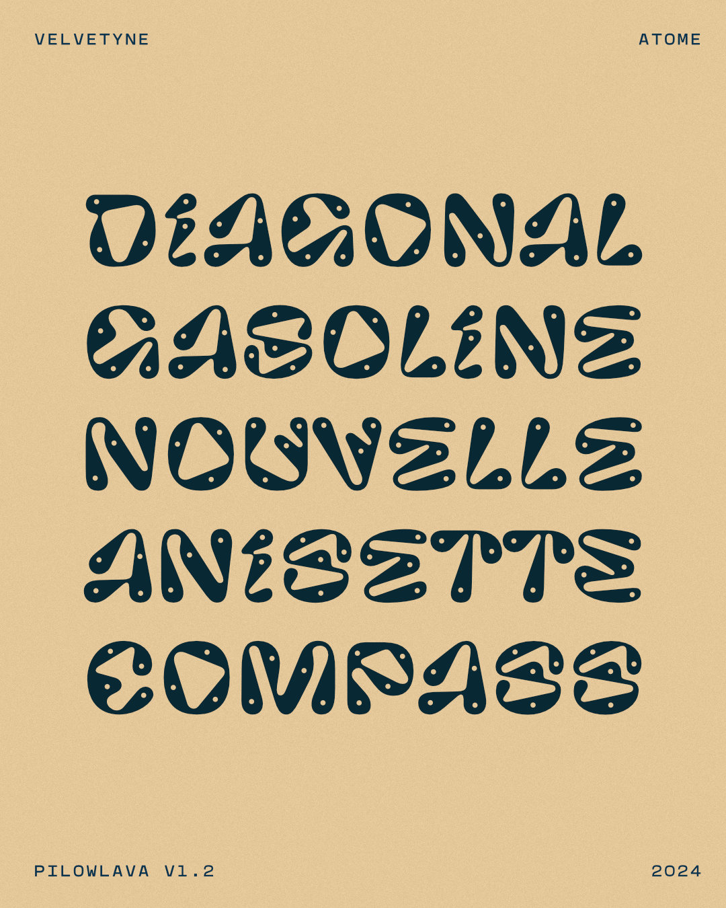
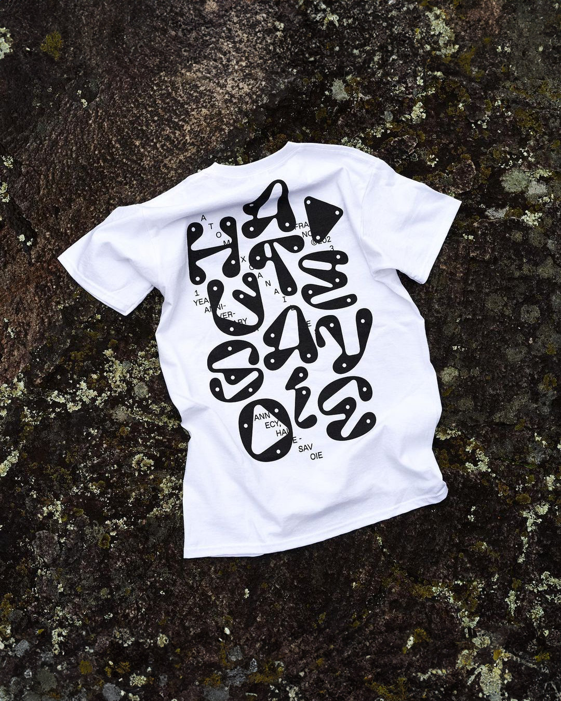
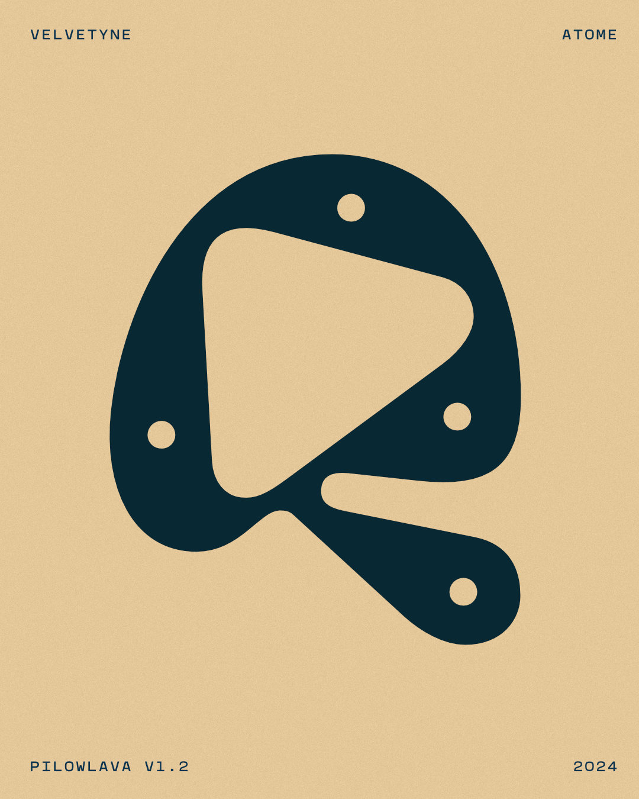

# Pilowlava (V1.2)

Pilowlava is a custom typeface designed by [Anton Moglia](http://moglia.fr) & [Jérémy Landes](http://studiotriple.fr/) for [Cercle Magazine](http://cerclemagazine.com/) and released by [Velvetyne Type Foundry](http://velvetyne.fr/fonts/pilowlava/) in 2019.

Support for Cyrillic was added in 2022 by [Maksym Kobuzan](https://www.instagram.com/mkobuzan/).

In 2024, [Anton Moglia](http://moglia.fr) introduced "Pilowlava Atome", a custom version with interior perforations in the letters to imitate climbing holds, developed for the climbing gym [Atome](https://www.atome-annecy.fr) in Annecy. The idea for this version came from a poster designed by graphic designer [Gabriel Robert](https://www.instagram.com/gabriel_robert_da/).

Pilowlava (sic) was born as an intuitive, fast-paced creative feedback loop in which its creators tried to amaze one another. The result is a typeface that recalls cooled lava flows drawn with a compass. Striving to please both its parents, Pilowlava seeks a balance between viscous energy and controlled geometry. The structures of its glyphs are mostly derived from hand-written dynamics, that feed from both calligraphic and graffiti references. All these sweet inconsistencies produce a vacillating, fluctuating typographic colour, delayed (?) by the almost-mathematical tension of its curves. Under a hardened crust, Pilowlava awaits the smallest heat rise to recover its viscosity. The alternate shapes of certains letters play out these thermic accidents and raise the temperature of the text.

It takes its name from pillow lavas, a natural phenomenon that is produced when lava is expelled by an underwater volcano. In contact with water, the lava flow is so hot that it's coated in a glass film. Not being totally cooled down, it transforms into smooth pillows that continue to grow slowly. This way, lava creates tubes and viscous balls that pile up and shape one another, and then they aggregate in puffy clusters that can measure several meters. Pilowlava is available at Velvetyne from today on. It's cost free, and can be freely used, modified and distributed for all of your burning needs.

Contribute or download it on [Velvetyne Type Foundry](http://velvetyne.fr/fonts/pilowlava/).

## Specimen

## License

Pilowlava is licensed under the SIL Open Font License, Version 1.1.
This license is copied below, and is also available with a FAQ at
http://scripts.sil.org/OFL

## Repository Layout

This font repository follows the Unified Font Repository v2.0,
a standard way to organize font project source files. Learn more at
https://github.com/unified-font-repository/Unified-Font-Repository
